# 🟩 pixel

> **Deterministic retrieval + git engine for LLM agents.**

If an answer can be retrieved deterministically — and with its certainty stated — from repo state, pixel retrieves it: no grepping, no manual git archaeology, no LLM reasoning about things a query can just answer. Every op returns a complete answer, an explicitly-bounded partial answer, or a structured ambiguity report; the LLM only steps in for genuine ambiguity, like a real merge conflict.

Inspired by [GitNexus](https://github.com/abhigyanpatwari/GitNexus) (code knowledge graph) and [Stacklit](https://github.com/glincker/stacklit) (compact codebase context for agents). Born from waiting 30 minutes for Claude to `git push`.

[](https://github.com/LivioGama/pixel)
[](https://www.rust-lang.org/)
[](https://opensource.org/licenses/MIT)
[](https://github.com/LivioGama/pixel-rules)

<a href="https://liviogama.github.io/agent-config/redirect.html?url=https://raw.githubusercontent.com/LivioGama/pixel-rules/main/rules/pixel.md"></a>

---

## 🧬 Origin story

pixel wasn't designed. It escalated.

**1. GitNexus opened the door.** A code knowledge graph for agents — the first hint that "grep harder" wasn't the answer. Useful, but slow, and not Rust. The itch started here.

**2. usable-git — the git tantrum.** Watching agents fumble `git push` for 30 minutes broke something. [usable-git](https://github.com/LivioGama/usable-git) was the response: make the boring, deterministic git ops actually deterministic so the LLM stops reasoning about things a script can just do.

**3. gitpixel — the Rust rewrite.** GitNexus was too slow and not Rust. So it got rebuilt from scratch as [gitpixel](https://github.com/LivioGama/gitpixel): indexed regex search, git-anchored freshness, tree-sitter code graph. The name wrote itself — the Google Pixel is newer than the Google Nexus.

**4. pixel — the merge.** usable-git handled git. gitpixel handled retrieval. Two tools, two binaries, two mental models for what was really one problem: *stop making agents reason about things a query can answer.* pixel absorbed both and became the single deterministic layer between the agent and the repo — a sniper for locating a phrase, catching an error that slips past Next.js and the browser console, or measuring the blast radius of a change before it lands.

**5. The transcript mining.** Even pixel wasn't enough — agents kept burning time on CLI sequences that take 0ms on an M5. So one month of CLI transcripts got extracted, fed back, and mined for recurring operation patterns. pixel now covers those patterns like a chief. *That* is the part that finally clicked.

> Five iterations, one trajectory: every step was the same realization hitting harder — **if it can be retrieved deterministically, retrieve it.**

---

## The problem

Most of the annoying LLM coding agent work falls into five scenarios. Today, agents handle them by reasoning through Git — scrolling diffs, guessing commits, running repetitive searches, and burning tokens on operations that should be deterministic.

| # | Scenario | What agents do today | What pixel does |
|---|---|---|---|
| 1 | **Locate code by a phrase or error** | 12 searches to find one label; no awareness of what you just changed | `resolve` → exact code with a confidence level, in milliseconds |
| 2 | **Scope a task before editing** | Reads 20 files, edits 15, breaks 3 unrelated features | `targets` → prioritized P0/P1/P2 file list before touching anything |
| 3 | **Synchronize branches** | 15s reasoning through `fetch`/`status`/`merge`; panics about force-push | `reconcile` → one call: fetch, classify, act; conflicts get a structured report |
| 4 | **Recover deleted code** | Wanders `git log`, does `git checkout` of an old version — erases fixes, destroys uncommitted work | `excavate` + `rescue` → finds code no longer at HEAD and restores it safely |
| 5 | **Edit blind** | Edits a widely-called function without knowing who calls it; breakage surfaces two tasks later | `impact` / `changes` → callers and affected flows before any edit |

The `targets` list is a starting set, not a read-fence — a hard block was tried and measured harmful (recall 0.60 → 0.19, [`docs/bench/sniper-discovery.md`](docs/bench/sniper-discovery.md)).

---

## 💡 What this looks like

The diagrams below illustrate the intended flows. The "without pixel" columns are **illustrative, not measured**; the pixel op time/token figures are single-op measurements from [`docs/examples/real-measurements.md`](docs/examples/real-measurements.md).

<table>
<tr><td align="center" width="50%"><b>Locating code by an error</b></td><td align="center" width="50%"><b>Starting a task</b></td></tr>
<tr><td align="center" width="50%"></td><td align="center" width="50%"></td></tr>
<tr><td align="center" width="50%"><b>Syncing a branch</b></td><td align="center" width="50%"><b>Recovering deleted code</b></td></tr>
<tr><td align="center" width="50%"></td><td align="center" width="50%"></td></tr>
<tr><td align="center" width="50%"><b>Searching the codebase</b></td><td align="center" width="50%"><b>Blast radius before editing</b></td></tr>
<tr><td align="center" width="50%"></td><td align="center" width="50%"></td></tr>
<tr><td align="center" width="50%"><b>Finding real callers</b></td><td align="center" width="50%"><b>Checking impact before committing</b></td></tr>
<tr><td align="center" width="50%"></td><td align="center" width="50%"></td></tr>
<tr><td align="center" width="50%"><b>Committing a change</b></td><td align="center" width="50%"><b>Reviewing a conflict</b></td></tr>
<tr><td align="center" width="50%"></td><td align="center" width="50%"></td></tr>
</table>

---

## ✨ Features

| Feature | Description |
|---------|-------------|
| **Search** | Indexed, git-anchored, ranked. `search --scope code` |
| **Code graph** | Tree-sitter across TS/TSX/JS/Rust/Go/Java/Python: `symbol`, `impact`, `uses`, `trace`, `changes`, token-budgeted `context` |
| **Resolve** | A phrase, label, or error → exact code, with an honest confidence level (`resolved` / `ranked` / `unresolved`) |
| **Query (V1)** | One bounded retrieval entry point: `query "where is \`symbol\`"`; compiles exact locate/scope/impact/history/status intents to deterministic recipes and returns ranked plans for ambiguous prose |
| **Excavate + rescue** | Finds code no longer at HEAD (deleted, stashed, on another branch) and restores it safely, refusing dirty files without a strategy |
| **Reconcile** | One-call branch sync: fetch, classify, act; real conflicts get a structured report, not silence |
| **Git mutations** | `publish`/`push`/`branch`/`update` etc., snapshot-token gated and crash-safe |
| **Ranking signals** | Recency and live session context rerank results, never promoting a stale file above a better match |
| **Daemon** | A warm background process keeps *service-time* sub-millisecond (CLI end-to-end still pays a ~17ms spawn floor); falls back to in-process automatically |

### Query V1

`pixel query` gives agents a single read-only retrieval entrance without hiding uncertainty. Exact intents compile to one bounded recipe and execute through the existing daemon-or-in-process path; ambiguous text returns ranked recipe candidates without broad retrieval.

```bash
pixel query 'where is `Epistemics`' . --json
pixel query 'show impact of LoginService' . --kind impact --json
```

The V1 recipes are `locate`, `scope`, `impact`, `history-recovery`, and `status`. The response records the chosen recipe, its evidence, a token budget, and explicitly bounded epistemics. Source completeness is typed: a required source must be complete, fresh, uncapped, and exclusion-free before Pixel can state `closed_world: true`.

### What V2 will add (speced in [`PLAN.md`](PLAN.md), not yet shipped)

The V1 surface is deliberately bounded. The deferred work is designed, not vague — each item is blocked on a concrete correctness invariant, not on effort:

| Deferred | Spec | Why it's held back |
|---|---|---|
| **Workspaces** | Multi-repo query scope in `PLAN.md` §A2 | Requires evidence identity to survive cross-repo joins before `closed_world` can be stated honestly |
| **Persisted query deltas** | `PLAN.md` §A2 (envelope `budget.cursor`) | Needs metadata capping end-to-end so a resumed query can't silently exceed its budget |
| **Transcript recall** | Machine daemon + recall corpus, `PLAN.md` §A3 / M5 | Same evidence-identity invariant — a recalled fragment must carry its provenance, not just its text |
| **Recipe auto-promotion** | `PLAN.md` §A2 (ranked recipe candidates → pinned) | Promotion must be observable + reversible; pinning a wrong recipe silently is worse than returning ranked plans |
| **Rescue `--from <oid>:<oldpath> --to <path>`** | Engine 2, `PLAN.md` line 171 | Restoring deleted/renamed files across path moves; the gated 3-way apply already exists, the cross-path variant is the open seam |
| **`reconcile --strategy rebase-if-clean`** | Engine 4, `PLAN.md` line 200 | Zero-textual-conflict rebase is deterministic work; default stays `report` until the `merge-tree` cleanliness proof is wired through the journal transitions |
| **Session journal hooks** | Engine 3, `PLAN.md` line 187 (`pixel journal <kind> <path>`) | `PostToolUse` → session.db feeding the shared reranker; activity/recency signals already ship, the live session-event stream is the missing input |

Anything not in that table is either shipped or out of scope. The V1 recipes (`locate.v1`, `scope.v1`, `impact.v1`, `history_recovery.v1`, `status.v1`) are the wire format today; V2 extends the recipe set, it does not break V1 responses.

---

## 📖 Agent Rules

pixel enforces five scenarios through **CLI + hooks**, not MCP:

- **Recovery** (mandatory): `pixel rescue` / `pixel excavate` — restore deleted/stashed code
- **Resolution** (mandatory): `pixel resolve` — find code by error/phrase/label
- **Branch sync** (mandatory): `pixel reconcile` — one-call fetch + classify + act
- **Task scoping** (advisory): `pixel targets` — mandatory *first call* of a task, but the returned list is a starting set, not a read-fence (the hard fence measured recall 0.60 → 0.19, [`docs/bench/sniper-discovery.md`](docs/bench/sniper-discovery.md))
- **Blast radius** (mandatory): `pixel impact` / `pixel changes` — callers and affected flows before any edit

Rules: [`~/.agent-config/rules/pixel.md`](https://github.com/LivioGama/pixel-rules) · Skill: `~/.agent-config/skills/pixel/SKILL.md`

The guard hook blocks destructive git commands and warns on edits outside the active targets list in indexed repos. Bypass with `PIXEL_TARGETS_GUARD=0`.

### Agent tool support

| Tool | Guard hooks | How |
|------|------------|-----|
| Claude Code | ✅ | `~/.claude/settings.json` |
| Devin | ✅ | `~/.config/devin/config.json` |
| Codex | ✅ | `~/.codex/hooks.json` |
| Gemini CLI | ✅ | `~/.gemini/settings.json` |
| zcode | ✅ | `~/.zcode/cli/config.json` (PreToolUse + SessionStart) |
| pi | ⚠️ rules only | `~/.pi/agent` memory file — extension API, no PreToolUse hooks |
| Cursor | ❌ | No hook support (VSCode extension) |
| OpenCode | ❌ | No hook support |
| Zed | ❌ | No hook support |

---

## 📄 License

MIT (derived code from hypergrep, MIT; ClickHouse sparse-grams algorithm, Apache-2.0 — see `NOTICE`).
