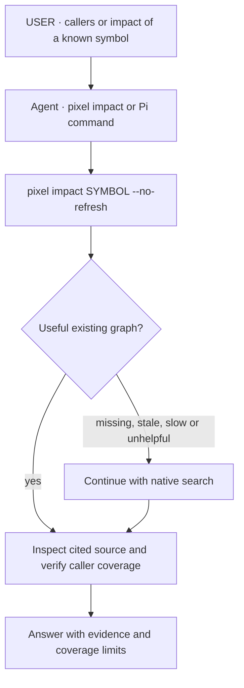
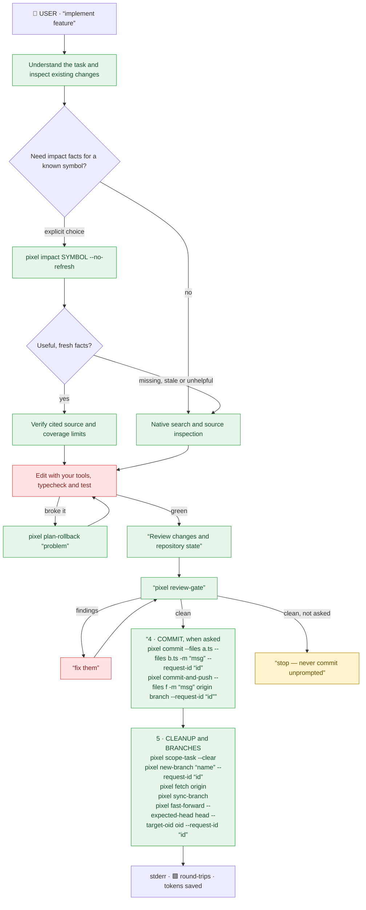

<h1 align="center">🟩 Pixel</h1>

<p align="center">
  <strong>Agents grep your code blind. Pixel hands them the map.</strong>
</p>

<p align="center">
  A tool that replaces everything that can be deterministic in repository work: search, symbols, callers, task scope, history, review and Git from one local CLI, so your AI coding agent spends its tokens on the hard part.
</p>

<p align="center">
  <b>−94.5% median read volume for outline questions</b> on 8 large files · one install, a handful of commands · no account, no API key, no telemetry beyond an optional release check.
</p>

<p align="center">
  <a href="https://github.com/Pixel-CLI/pixel/releases/latest"></a>
  <a href="https://github.com/Pixel-CLI/pixel/actions/workflows/ci.yml"></a>
  <a href="https://www.bestpractices.dev/projects/15211"></a>
  <a href="https://www.bestpractices.dev/projects/15211"></a>
  <a href="SECURITY.md#verifying-a-release"></a>
  <a href="https://github.com/Pixel-CLI/pixel/releases/latest"></a>
  <a href="LICENSE"></a>
</p>

<p align="center">
  <a href="https://pixel-cli.dev/"><b>Website</b></a> ·
  <a href="https://pixel-cli.dev/docs/"><b>Docs</b></a> ·
  <a href="https://pixel-cli.dev/benchmarks/"><b>Benchmarks</b></a>
</p>

<p align="center">
  
</p>

The animation illustrates a workflow; it is not a timed agent comparison.
[Agent trials and their limits](https://pixel-cli.dev/benchmarks/#on-whole-agent-tasks) include a newer Opus trial with hooks that found no speed gain on one task.

- **A local index of signatures and callers that your agent queries before it greps**: 94.5% less read volume (median) for outline questions using `pixel list-signatures` than whole-file reads on 8 large open-source files. [How we measure](https://pixel-cli.dev/benchmarks/#well-known-files)
- **Native tools stay available**: Claude and Codex get a bounded evidence brief with each code prompt; Pi offers an explicit `/pixel-impact` command. Other agent integrations retain their existing policies.
- **No account. No API key. No telemetry beyond an optional release check.** Your code stays on your machine.
- **13 languages, MIT**, macOS (Apple Silicon) and Linux, signed releases.

## Why

- **79.7 to 97.2% less read volume** (median 94.5%): whole files versus signatures on eight pinned large files with Pixel 0.5.0; tokens estimated as UTF-8 bytes ÷ 4, not session cost. Files: Hugging Face Transformers, FastAPI, Next.js, LangChain, Django, CPython, VS Code and Tokio; no second model reading on the agent's behalf. [The files](https://pixel-cli.dev/benchmarks/#well-known-files)
- **Measured against GitNexus** on the same 29 blast-radius cases and machine: callers found at a tie (0.86 against 0.84), a 153 ms median answer against 432 ms, and ~4,160 tokens of context per turn against ~19,700. GitNexus wins on Cypher queries, taint analysis and Ruby callers. Pixel is MIT; GitNexus is PolyForm Noncommercial. [The cases](docs/bench/vs-gitnexus.md)
- **Evidence with boundaries.** Every answer says whether it is complete, capped or stale; a static call graph never claims it saw every caller.
- **Local and mostly deterministic.** The index lives in `.pixel/` at the repository root and stays on your machine; no telemetry beyond an optional release check. Index queries are deterministic; the optional `pixel classify` (the one model-backed command) is not. Only Git remotes, `pixel classify` and `pixel web-search`, a one-time embedding model download, and a release check throttled to at most once per day when a person is at a terminal (`PIXEL_NO_UPDATE_CHECK=1` turns it off) use the network.
- **Safer Git.** `pixel impact` before an edit, `pixel commit-and-push` designed to be crash-safe after it, never a raw `--force`.

## `pixel classify`: your local Jev

Use `pixel classify` to choose between named options. The example below is the
same one shown on the [homepage](https://pixel-cli.dev/): it compares three
model tiers for a Rust PR review and returns one probability per label, then
`predicted:` for the highest score.

```bash
pixel classify "Review this Rust PR, find correctness bugs, and propose a safe patch." \
  --engine ollaya \
  --context "Choose the cheapest model that can reliably handle the request." \
  --label 'claude-haiku-4.5_(fast)' \
  --label 'claude-opus-5.5_(strong)' \
  --label 'claude-fable-5.1_(reasoning)' \
  --criterion 'claude-haiku-4.5_(fast)=Simple rewriting, extraction, or classification; no deep reasoning.' \
  --criterion 'claude-opus-5.5_(strong)=Complex coding, multi-file review, or tool use; accuracy matters.' \
  --criterion 'claude-fable-5.1_(reasoning)=Multi-step analysis, difficult debugging, or high uncertainty.'

claude-fable-5.1_(reasoning): 0.192
claude-haiku-4.5_(fast): 0.098
claude-opus-5.5_(strong): 0.710
predicted: claude-opus-5.5_(strong)
```

One local run using Ollaya: each score is the model's probability for that
label; `predicted:` is the top choice. This is Pixel's local Jev-style decision
mode. In the published typed-decision benchmark, Ollaya's `winnow:e4b` scored
0.722 accuracy; hosted TypeSafe Jev scored 0.738. [Benchmark details](https://pixel-cli.dev/benchmarks/#coding-decisions).

Clef-flash, Cloudflare's 9B decision model, is a typed-decision engine too:
`--remote-preset clef-ollama` runs it through Ollama (`ollama pull clef-flash`,
no key) and `clef-cloudflare` through Workers AI (API token and account id).
The 38.8 ms median latency and 98.76 case-exact on BFCL it reports against
Jev's 524.1 ms and 95.75 are Cloudflare's own figures, not a Pixel measurement.

Remote decisions (uses fast LLMs, not the System One model) can also return scores, through
OpenRouter, Ollama Cloud, DeepSeek, OpenCode Go, or a local OpenAI-compatible
endpoint (`--engine remote
--remote-preset openrouter|ollama|deepseek|opencode-go|local`). On 14 public
coding prompts:

| Model | Provider (preset) | Score |
|---|---|---|
| deepseek-v4.1-flash | Ollama Cloud (`ollama`) | **14/14 (1.00)** |
| deepseek-v4-flash | Ollama Cloud (`ollama`) | 13/14 (0.93) |
| gpt-oss:120b / gpt-oss:20b | Ollama Cloud (`ollama`) | 13/14 (0.93) |
| nemotron-3-ultra | Ollama Cloud (`ollama`) | 12/14 (0.86) |
| google/gemini-3.1-flash-lite | OpenRouter (`openrouter`) | 11/14 (0.79) |
| qwen3.5:397b | Ollama Cloud (`ollama`) | 10/14 (0.71) |

These are benchmark accuracy scores, not per-decision probabilities.
[Full model results and method](docs/bench/decide-bakeoff.md).

## Install

```bash
curl -fsSL https://github.com/Pixel-CLI/pixel/releases/latest/download/install.sh | sh
pixel install      # once: wires Claude Code, Codex, Pi, OpenCode and Antigravity
pixel doctor .     # optional health check
pixel list-signatures path/to/a/large/file   # first result: full read vs Pixel, in tokens
```

The one-liner runs [`install.sh`](scripts/install.sh): one POSIX `sh` file, no `sudo`, which verifies the release's SHA-256 and writes one file, `~/.local/bin/pixel`.

## For AI agents

Setting Pixel up for someone? Paste this into their Claude Code, Codex, Pi or any coding agent with a shell:

```text
Install Pixel (https://github.com/Pixel-CLI/pixel) for me: follow the
"For AI agents" section of its README, then tell me what changed and
whether `pixel doctor .` is green.
```

If you are that agent: run the Install one-liner, tell the user it writes to their home configuration, then run `pixel install` (idempotent) and `pixel doctor . --json` — report every check that is not green, do not claim success otherwise. Restart the session to load updated integrations. Codex and Claude keep native retrieval and receive a bounded evidence brief on each code prompt (`PIXEL_BRIEF=0` turns it off). Pi exposes `/pixel-impact <symbol>`. [Manual setup](docs/manual-setup.md) explains each surface.

## Now build this harness

Codex and Claude keep ordinary search native; the per-prompt brief resolves a named symbol and its callers from an existing graph without rebuilding it. Run `pixel impact <symbol> --no-refresh` yourself when a known symbol's callers or blast radius matter; Pi provides `/pixel-impact <symbol>`. Task lifecycle controls remain independent.

**Ask about the code** — "find callers of X", "explain this flow":



**Implement a feature** — "implement feature":



- Red is the LLM — reasoning, meaning, edits
- Orange is `pixel classify` — a model system one like Jev
- Green is Pixel-CLI — deterministic
- Yellow is `stop` — never commit unprompted

## More

- [Documentation](https://pixel-cli.dev/docs/): install, updating, plugins, every command
- [Benchmarks](https://pixel-cli.dev/benchmarks/): every number with its method, losses included
- [ARCHITECTURE.md](ARCHITECTURE.md): crates and the full command surface
- [CONTRIBUTING.md](CONTRIBUTING.md): build from source, gates, pull requests
- [GOVERNANCE.md](GOVERNANCE.md): maintainers, roles and who holds the project's sensitive resources
- [Report a bug](https://github.com/Pixel-CLI/pixel/issues/new?template=bug_report.yml): the issue form asks for the version, the platform and the steps to reproduce; vulnerabilities go through [SECURITY.md](SECURITY.md) instead

MIT licensed. See [`NOTICE`](NOTICE) for attribution.

### GitHub Actions

Prepare Pixel for CI agents with the reusable [setup action](docs/github-actions.md):
verified release installation and daemon-free indexing on Linux and macOS ARM64.
