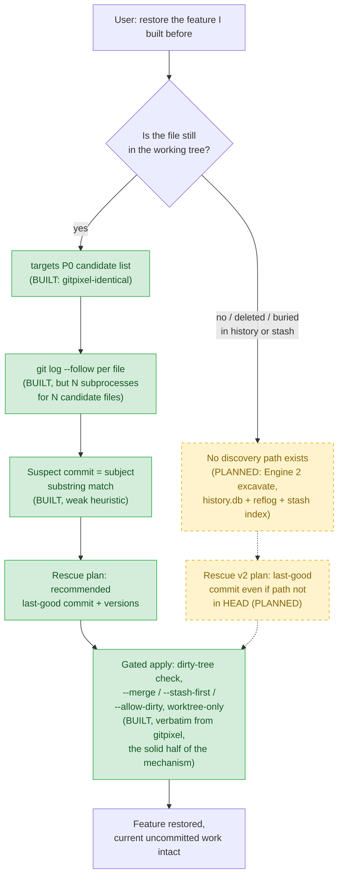
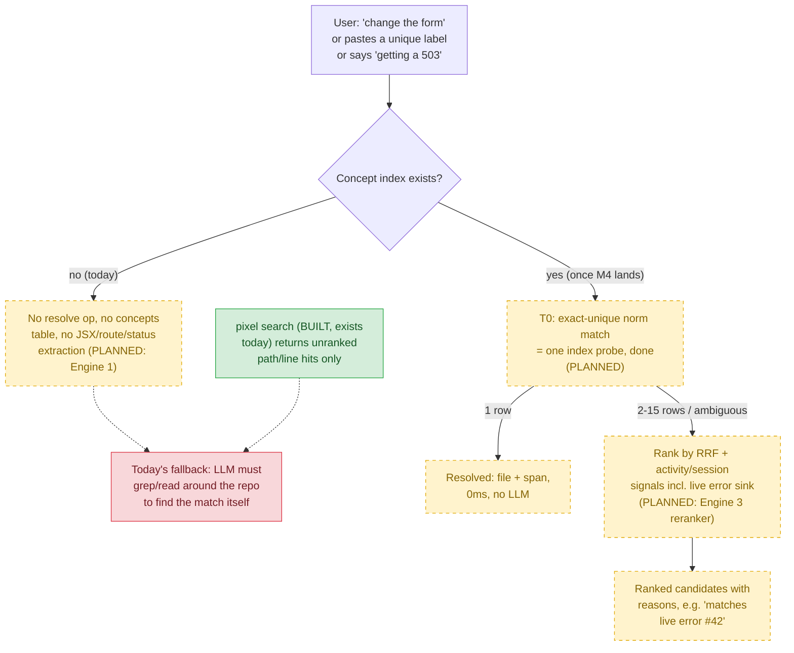
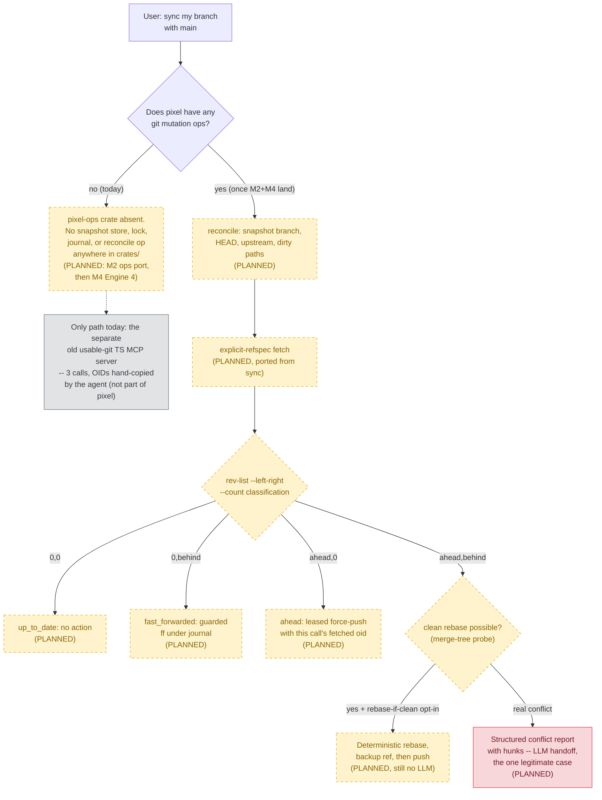
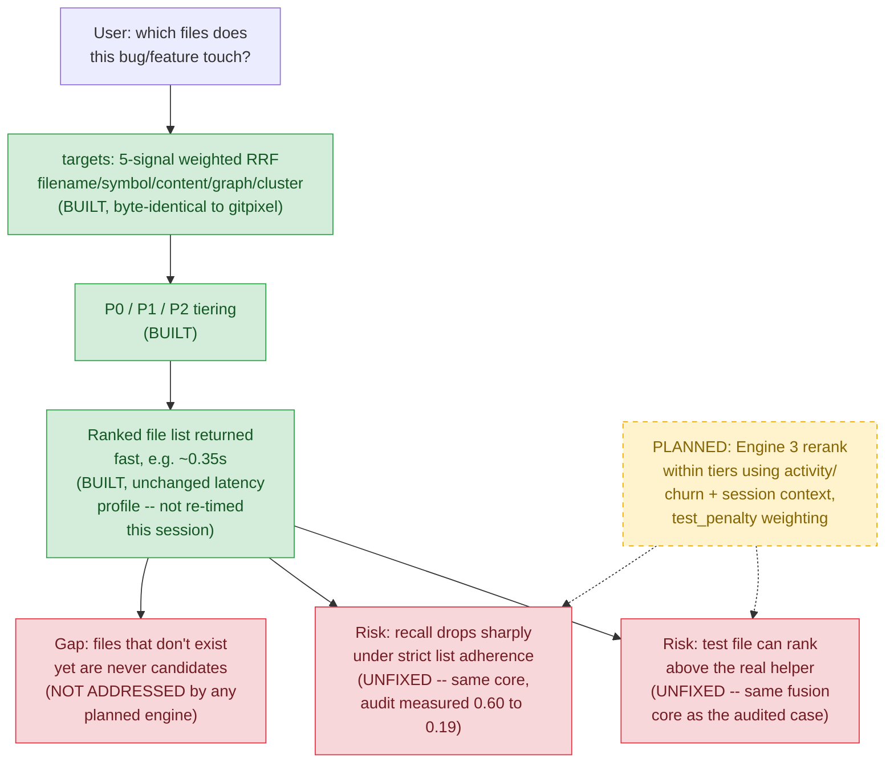

# pixel — Scenario Coverage (measured against current repo state)

This document re-measures the four reference scenarios from `PLAN.md` against the **actual code
in `/Users/livio/Documents/pixel` right now** (one commit: `9d707dd chore: seed pixel from the
gitpixel workspace`), not against the plan's narrative. Every percentage below is backed by a
concrete file check (`diff` against the gitpixel original, `grep` for the feature, or `ls` for a
crate/file that would have to exist). Where the current repo is 100% design and 0% code, that is
stated plainly — the point of this document is to be honest about real vs. planned, not to make
the plan look further along than it is.

## Summary

| Scenario | Coverage % today | Closing engine | Milestone |
|---|---|---|---|
| 1 — Recover & restore historical code | **~25%** | Engine 2 (`excavate` / rescue v2) | M4 |
| 2 — Instantly locate the relevant code | **~5%** | Engine 1 (`resolve`) + Engine 3 (ranking) | M4 |
| 3 — Deterministic branch sync | **0%** | pixel-ops port (M2) + Engine 4 (`reconcile`) | M2 / M4 |
| 4 — Sniper `targets` for a task | **~40%** | Engine 3 (ranking signals, within-tier rerank) | M4 |

Repo-state facts that hold across all four scenarios:

- `crates/` currently contains: `pixel`, `pixel-bench`, `pixel-context`, `pixel-daemon`,
  `pixel-git`, `pixel-graph`, `pixel-index`, `pixel-proto`, `pixel-recall`, `pixel-session`.
- `pixel-proto` and `pixel-git` **do exist** and are real, non-trivial crates (768 and 959 lines
  of Rust respectively) — they are the new plumbing PLAN.md describes (contract envelope/error
  codes/snapshot type, and a unified git subprocess wrapper). Neither implements any
  scenario-closing behavior itself; `pixel-proto/src/op.rs` states in its own doc comment that it
  mirrors the daemon's existing `Request` enum and is "not yet wired into `pixel-daemon`".
- `pixel-ops`, `pixel-rank`, and `pixel-facts` — the three crates PLAN.md assigns to the git
  mutation port, the extracted fusion core, and history/concept storage — **do not exist**.
  `grep -rl "excavate|reconcile|concept" crates/*/src` returns zero matches anywhere in the
  workspace, and the `Op` enum in `pixel-proto/src/op.rs` only has the twelve gitpixel-era
  variants (`Search`, `Targets`, `Symbol`, `Context`, `Impact`, `Uses`, `Trace`, `Processes`,
  `Clusters`, `Changes`, `Graph`, `Status`) — no `Resolve`, `Excavate`, or `Reconcile` variant.
- `crates/pixel-graph/src/extract.rs`, `crates/pixel-daemon/src/targets.rs`, and
  `crates/pixel/src/rescue_cmd.rs` are **byte-identical** to their gitpixel originals except for
  crate-name renames (`diff` against `/Users/livio/Documents/gitpixel` returns 0 lines of real
  change on `extract.rs` and `rescue_cmd.rs`, and only import-path renames on `targets.rs`). This
  is exactly what M0 ("seed by copy") promises — no scenario-closing logic has been written yet.
- `reference/usable-git/` exists and holds the copied TS sources/tests/specs, per M0's plan —
  confirming the porting spec is staged, but nothing has been ported into Rust yet.

---

## Scenario 1 — Recovering and restoring previously implemented code

**Restated:** the user wants to bring back a feature that used to exist in the codebase — maybe
committed recently, maybe buried deep in history, maybe only reachable via a stash or a dangling
commit no branch points at. They want the exact files found instantly, the real historical
implementation restored (not an LLM's guess at reconstructing it), and the restore to respect
whatever is already in the working tree right now — no `git checkout` that silently deletes
uncommitted work or resurrects bugs that were fixed after that old commit.

**Coverage today: ~25%.**

- **Built and working:** the gated restore mechanism itself. `crates/pixel/src/rescue_cmd.rs` is
  byte-for-byte the gitpixel original (confirmed via `diff`, zero output) — it plans a restore,
  refuses to touch a dirty working tree unless one of `--merge` (3-way `git merge-file`),
  `--stash-first`, or `--allow-dirty` is given, and always writes to the working tree only (index
  and HEAD untouched). This is the part of the scenario that keeps the user's current uncommitted
  work safe, and it is real, ported code, not a plan.
- **Not built — discovery is still the same limited mechanism gitpixel had before the audit:**
  - Candidates come only from `targets` P0, which only sees files that exist in the current
    working tree at HEAD (`rescue_cmd.rs` builds its candidate list from live-tree targets). A
    feature whose file was later deleted is invisible to `rescue` today — the scenario's "far
    back in history" and "code that exists nowhere reachable" cases are unaddressed.
  - Discovery per candidate file still runs `git log --follow` as its own subprocess
    (`crates/pixel/src/rescue_cmd.rs:99`, `"--follow"`) — an N-subprocess fan-out for N candidate
    files, not the single indexed query PLAN.md's Engine 2 promises.
  - Suspect-commit detection is still subject-line substring matching
    (`crates/pixel/src/rescue_cmd.rs:118`, `subject_lc.contains(k.as_str())`) — not the
    diff-overlap detection (hunks whose actual added/removed text intersects the phrase) that
    PLAN.md calls out as the fix for the case where the commit message doesn't mention the
    feature by name.
  - There is no `history.db`, no reflog-only or stash-only commit indexing, and no pickaxe/`--all`
    search anywhere in the workspace (`grep -rl "excavate|reflog" crates/*/src` — zero matches).
    The user's explicit worry ("agents forget to check the stash") is not mechanically prevented
    by anything in the current code; nothing surfaces stash contents automatically.

**What closes the gap:** Engine 2 (`excavate` op + rescue v2) — background-ingested,
reflog/stash/pickaxe-aware history index feeding rescue with candidates that include deleted
files, plus diff-overlap suspect detection replacing subject-substring matching. Per PLAN.md,
this is **M4**, and it explicitly depends on Engine 3's reranker landing first.

No LLM reasoning is required anywhere in this flow, today or planned — the entire point of
`rescue` is that it never asks a model to "figure out" the right commit. The only unclosed part is
that the discovery half currently has a hard blind spot (deleted/buried code), not an ambiguity
that needs a model — it needs the index Engine 2 hasn't been built yet.

---

## Scenario 2 — Instantly locating the relevant code

**Restated:** paste a UI label that appears in exactly one place, or refer to "the form" when
there's only one meaningful form, or mention "I'm getting a 503" — the system should jump straight
to the exact code with no searching, and when there are multiple candidates it should rank them
using history, current session activity, and what's actively erroring, the way a human who knows
the codebase would.

**Coverage today: ~5%.**

- **Built:** raw ingredients only. `pixel search` (trigram regex, ported verbatim from
  gitpixel-core) can find a literal string if the user reruns it manually, and `pixel-daemon`'s
  `targets.rs` fusion core can rank files against a free-text task description — but neither does
  what the scenario asks for. `search` still "returns raw path/line order — no ranking" exactly as
  PLAN.md's audit found (unchanged from gitpixel: no code in `pixel-index` scores hits).
- **Not built — this is essentially the whole scenario:**
  - No concept index exists. `crates/pixel-graph/src/extract.rs` is byte-identical to gitpixel's
    original (`diff` = 0 lines) — it extracts declarations/calls/imports only. There is no
    `concepts` table, no `RawConcept`, and no extraction of JSX/markup text, `placeholder`/`label`
    /`aria-label` attributes, form elements, routes, or status-code literals anywhere in the
    workspace (`grep -n "jsx_text|RawConcept|ui_text|route|concepts" extract.rs store.rs` — zero
    matches). A pasted label or "the form" has nothing to resolve against.
  - There is no `resolve` op. It is absent from `pixel-proto`'s `Op` enum, absent from
    `crates/pixel/src/main.rs`'s CLI subcommands, and absent from the daemon dispatch.
  - There is no activity/churn or session-signal reranking. `targets.rs`'s RRF weights
    (filename/symbol/content/graph/cluster) are unchanged from gitpixel — no `activity_norm`, no
    `session_norm`, no error-sink join. The "503 currently thrown by this endpoint should rank
    first" behavior has no data source to draw on (no session journal, no live error sink wired
    into ranking).

**What closes the gap:** Engine 1 (concept index + `resolve`, including the T0
exact-unique-match short-circuit that makes the pasted-label case a single index probe) for
discovery, plus Engine 3 (activity/session reranking, including the live-error-sink join) for the
"multiple candidates, rank by what's actually happening" half. Both are **M4**; PLAN.md's build
order runs Engine 3 first because Engine 1 and 4 both consume its shared reranker.

Today the LLM is unavoidably in the loop for this scenario (the red node) because no deterministic
resolution mechanism exists yet — the diagram's built path is a dead end that still requires model
reasoning. Once Engine 1/3 land, the LLM only re-enters for a genuinely unresolved miss.

---

## Scenario 3 — Deterministic Git operations (branch sync)

**Restated:** "sync my branch with another branch" should be one deterministic call — fetch,
classify ahead/behind/diverged, then either fast-forward or safely force-push with a lease — with
no LLM reasoning and no manually copy-pasted OIDs, unless there's a genuine merge conflict, which
is the one case that legitimately needs a model.

**Coverage today: 0%.**

- **Built:** nothing. This is the cleanest zero in the whole audit. `pixel-ops` — the crate
  PLAN.md assigns to port usable-git's snapshot store, repository lock, operation journal, and the
  eleven safe ops (`inspect`, `review`, `history`, `diff`, `publish`, `push`, `ship`, `branch`,
  `sync`, `update`, `search`) — does not exist in `crates/`. There is no `reconcile` op, and no
  mutation machinery of any kind: `grep -rl "OperationJournal|RepositoryLock|SnapshotStore"
  crates/*/src --include=*.rs` matches nothing (the few hits for the bare words "publish"/"push"/
  "sync"/"lock" in the workspace are unrelated Rust vocabulary — `Vec::push`, `Send + Sync`,
  `Mutex` locking, graph "publish" meaning "make the built graph.db visible" — none of them touch
  git mutation semantics).
  usable-git's actual `sync`/`update`/`push` TS implementation still runs as a separate MCP server
  (`mcp__usable-git__*` is available in this environment) — but that is the **old tool**, not
  `pixel`, and it still requires the three-call, manually-transcribed-OID flow PLAN.md's audit
  describes. Nothing in the `pixel` repository closes any part of this scenario yet.
- `reference/usable-git/packages/usable-git/src/mutations/` is copied into the repo as the porting
  spec (confirmed present under `reference/usable-git/`), which is the correct M0 prerequisite —
  but a copied spec is not a Rust implementation.

**What closes the gap:** two sequential milestones, not one. **M2** ("Semantic git ops") has to
land the `pixel-ops` port of the eleven safe ops (snapshot store + lock + journal + the crash
matrix re-run in Rust) before Engine 4's `reconcile` can be built on top of it — PLAN.md is
explicit that `reconcile` sits "under the ported lock+journal." Engine 4 (`reconcile` itself,
one-call fetch+classify+act, `rebase-if-clean` opt-in, full conflict report) is **M4**, and is
called out as independently parallelizable with the ops port once M2's foundation exists.

Every box below "does pixel have any git mutation ops" is planned, not built — the entire
deterministic pipeline this scenario asks for is design only inside the `pixel` repo today.

---

## Scenario 4 — Instantly identifying the impacted files for a task ("sniper targets")

**Restated:** ask "which files does this bug/feature touch" and get back a small, ranked,
trustworthy file list fast enough and accurate enough to scope an agent's edits to — without the
list dropping the real recall the moment an agent is held strictly to it, without a test file
outranking the real implementation helper, and ideally covering files a task will need to create,
not just ones that already exist.

**Coverage today: ~40%.**

- **Built and working:** the `targets` op itself, unchanged. `crates/pixel-daemon/src/targets.rs`
  is line-for-line identical to gitpixel's original (724 lines both sides; `diff` shows only
  `gitpixel_graph` → `pixel_graph` import renames) — the same five-signal weighted RRF fusion
  (filename 3.0 / symbol 2.5 / content 1.5 / graph 1.0 / cluster 0.5, K=60) with P0/P1/P2 tiering
  that gitpixel already shipped. This machinery genuinely returns fast (gitpixel's own
  measurements — not independently re-timed in this pass, but the code path is byte-identical so
  there is no reason latency would have changed) and produces plausible results.
- **Not built — the specific failure modes the scenario names are still live, unchanged:**
  - No recency/churn signal. `grep -n "activity|session|churn|recency" targets.rs` finds no
    matching field or weight — the exact gap PLAN.md's audit already flagged in gitpixel, and
    nothing in this repo has touched it since the rename.
  - No session-context signal (recent edits, active errors) feeding the ranker — `session.db` /
    `session_events` do not exist; `pixel-session` (the crate that would own them) currently only
    contains the ported sniper error-sink/transcript code (`store.rs`, `mcp.rs`, `parsers.rs`,
    `query.rs`), not a targets-facing signal.
  - The specific bug PLAN.md's audit measured — a `.test.ts` file ranking above the real
    implementation helper — has no fix in the code, because the fix (`test_penalty` reranking
    inside tiers) is part of Engine 3, which doesn't exist yet.
  - The recall-under-strict-adherence regression (0.60 → 0.19 across 48 runs, per the audit) is a
    property of this exact unchanged fusion core, so there is no reason to expect it has improved.
  - Not-yet-existing files (a file a feature would need to create) are still categorically outside
    candidate generation — PLAN.md is explicit this gap is **not** closed by Engine 3 either
    (rerank-only, no new candidate channels), so it remains open even after M4.

**What closes the gap:** Engine 3 (activity/churn + session-context reranking, applied *within*
existing P0/P1/P2 tiers so it can't promote junk into P0) is the design's answer to the
test-file-above-helper failure and to some of the recall loss — it is **M4**, and PLAN.md's build
order runs it first among the three remaining engines specifically because `resolve` and
`reconcile` both consume its shared reranker. The not-yet-existing-file gap has no engine assigned
to it at all — it should be tracked as a known, currently unaddressed limitation, not implied to
be fixed by M4.

No LLM is involved in this flow today, which is exactly the doctrine — the open problem is
correctness/recall, not a missing deterministic mechanism, and Engine 3's fix is itself
deterministic (no model reasoning added). The not-yet-existing-file gap is honestly unclosed by
the current design and should stay flagged rather than implied fixed once M4 ships.
